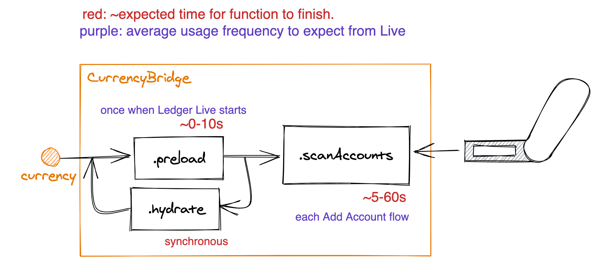

# `CurrencyBridge`: scan accounts with a device

> Prerequisite: [Currency](./currency.md).

CurrencyBridge offers a generic abstraction (for all crypto currencies) to add accounts with a Ledger device.



**[types](../src/types/bridge.js)**

```js
export interface CurrencyBridge {
  scanAccounts({
    currency: CryptoCurrency,
    deviceId: string,
    syncConfig: SyncConfig,
    scheme?: ?DerivationMode
  }): Observable<ScanAccountEvent>;
  preload(): Promise<Object>;
  hydrate(data: mixed): void;
}
```

## `getCurrencyBridge`

`getCurrencyBridge` is the entrypoint to get a bridge instance for a given currency.

```js
import { getCurrencyBridge } from "@ledgerhq/live-common/lib/bridge";

const bridge = getCurrencyBridge(cryptoCurrency);
```

## Finding accounts with `scanAccounts`

_Scans all available accounts with a Ledger device._

```js
scanAccounts({
  currency: CryptoCurrency,
  deviceId: DeviceId,
  scheme?: ?DerivationMode,
  syncConfig: SyncConfig
}): Observable<ScanAccountEvent>;
```

This technically will derivate addresses/xpubs with the device and iterate on paths while there are accounts. To offer a simple experience for users, it unifies all possible [derivation scheme](./derivation.md) and will emit accounts found in different contexts (for instance legacy, segwit, native segwit, derivation paths of MyEtherWallet,...)

- `currency`: [CryptoCurrency](./currency.md). The crypto currency to start accounts on.
- `deviceId`: string. identify a [device](./hw.md) to use for scanning accounts.
- `syncConfig`: [SyncConfig](../src/types/pagination.js). Configure user specifics like pagination,...
- `scheme`: ?[DerivationMode](./derivation.md). Optionally filter a specific mode to filter.

It emits an observable of `ScanAccountEvent`, which at the moment is only one event:

```js
export type ScanAccountEvent = {
  type: "discovered",
  account: Account
};
```

The observable can be unsubscribed at any time.

## `preload` and `hydrate`

_Preload some currency data (e.g. tokens, delegators,...) required for live-common feature to correctly work._

```js
preload(): Promise<Object>;
```

returns a promise of a serializable object (aka can be `JSON.stringify`ed). It can fail if data was not able to load.

```js
hydrate(data: mixed): void;
```

takes in parameter the same data that is returned by `preload()` (serialized form) and allows to reinject that preloaded data (typically coming from a cached) in a way that a `preload()` would be a noop that instantly resolved if the data was not "invalidated". The data coming in parameter however must be treated as unsafe (that's why it's `mixed` typed). Implementations must validate all fields and be backward compatible.

> N.B. Both preload() and hydrate() implementation are expected to have side effects in live-common (with caches). That technically makes live-common a [non-pure library](https://webpack.js.org/guides/tree-shaking/).

In live-common lifecycle, Preload/Hydrate must have been resolved before doing scan accounts or using [AccountBridge](./AccountBridge.md) of the associated currency.

**This allows to implement cache system and typically make Ledger Live resilient to network being down.** The fact it's guaranteed that preload() was done as soon as accounts were loaded makes it possible to have data cached and hydrated without network.

## Serialized usage

TO BE DOCUMENTED. usage in Ledger Live Desktop in context of serialization.

```js
type ScanAccountEventRaw = {
  type: "discovered",
  account: AccountRaw
};
```
